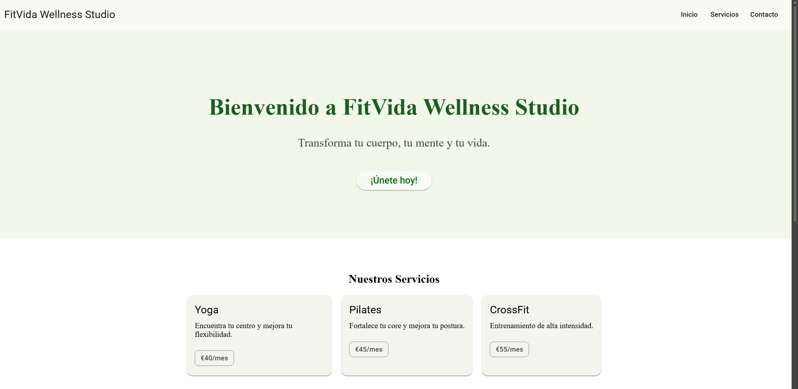

# FitVida Wellness Studio
**Alumno/a:** [TU NOMBRE AQUÍ]

Proyecto de práctica de Angular Material utilizando la identidad de marca del cliente (colores #2E7D32 y #FF8F00). 
Se han completado todos los requisitos de tematización de Angular Material.

## Requisitos Previos

Asegúrate de tener instalado Node.js en tu sistema.

## Instalación y Ejecución

Para iniciar el proyecto en tu máquina local, sigue estos pasos:

1. Abre una terminal en el directorio del proyecto.
2. Descarga las dependencias ejecutando:
   ```bash
   npm install
   ```
3. Inicia el servidor de desarrollo ejecutando:
   ```bash
   ng serve
   ```
   *Nota:* Alternativamente, puedes usar `npm start` si tu sistema no reconoce el comando global de `ng`.

El servidor de desarrollo iniciará, y podrás ver la aplicación funcionando abriendo `http://localhost:4200/` en tu navegador de internet.

## Captura de Pantalla

*(Reemplazar o añadir aquí abajo la captura de pantalla de la página funcionando en el navegador en la que se vean los componentes:* ``*)*

